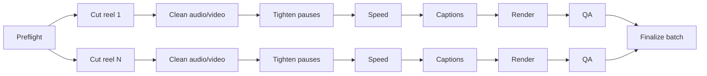

# LocalCut + AutoEditPost pipeline plan

## Outcome

One local MCP server owns projects, timelines, and durable talking-head jobs.
AutoEditPost remains the media engine. No ChatCut account or hosted editor is
required, and publishing is deliberately outside the boundary.

## Execution graph

The scheduler repeatedly selects dependency-ready nodes, runs at most the
configured concurrency, checkpoints after every transition, and retries a
failed node up to the run's retry limit. A restarted MCP server changes stale
`running` nodes back to `pending`, so the same job resumes instead of starting
over. Each media stage independently skips a fresh artifact.

## Quality loop

1. Render only after every upstream artifact exists.
2. Probe the final container, video, audio, duration, and size.
3. Verify the ASS caption stream has events and contains the forced CTA.
4. Preserve manifest risk notes as review warnings.
5. Optionally run the slower faster-whisper caption/audio guard.
6. Retry technical failures; leave content-risk warnings visible for a person.

## Local tools

- Existing LocalCut project, asset, timeline, split, and export tools.
- `create_talking_head_pipeline`: build and persist the graph.
- `run_talking_head_pipeline`: start or resume it in the background.
- `read_talking_head_pipeline`: inspect state, graph, warnings, and artifacts.
- `list_talking_head_pipelines`: discover jobs.
- `retry_talking_head_pipeline`: reset exhausted nodes and their dependants.
- `cancel_talking_head_pipeline`: stop new work and terminate active stages.

## Portability

LocalCut bundles Windows-compatible FFmpeg/FFprobe through npm, materializes the
executables into `%LOCALAPPDATA%/LocalCut/bin` (Windows cannot launch them from
this NAS share), and passes those paths to AutoEditPost. AutoEditPost also honors
explicit `FFMPEG_PATH` and `FFPROBE_PATH` overrides. Transcription remains selectable: a user-owned API,
local Whisper, local VAD, or a safe no-extra-tightening fallback after the core
silence trim.
